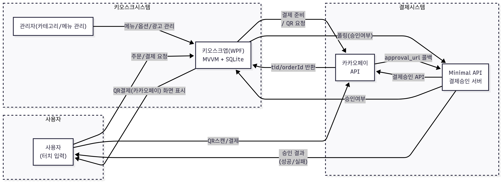

# 키오스크 서버

## 프로젝트 개요

  **키오스크 클라이언트**입니다.  
- WPF .NET8 MVVM 데스크탑 앱 + Minimal API 기반 카카오페이 승인 서버 + SQLite
- 터치 UI, 실시간 메뉴·옵션 관리, QR 기반 카카오페이 결제, 관리자/사용자 분리
- **클라이언트**: WPF(.NET 8, MVVM), SQLite 내장, 모든 메뉴/옵션/카테고리/광고 이미지 관리, 실시간 주문/장바구니/결제 UX/UI
- **서버**: Minimal API(.NET 8) 기반 카카오페이 승인 폴링/콜백 처리, QR결제 연동


---

## 아키텍처

### 전체 구조

```plaintext
KakaoPayApprovalServer/
├─ Program.cs        # Minimal API 서버 진입점
│   ├─ /register-tid   # WPF앱에서 tid/orderId 등록 (POST)
│   └─ /approve        # 카카오페이 approval_url 콜백 (GET)
└─ 기타 (의존성/설정 없음, 단일 파일)
```

---

## 요구사항 및 NuGet 라이브러리

### 키오스크 클라이언트
- **운영체제:** Windows 10/11
- **.NET:** .NET 8 이상
- **IDE:** Visual Studio 2022 이상
- **DB:** SQLite (파일 자동생성)
- **NuGet 패키지:**
  - `CommunityToolkit.Mvvm` (MVVM 구조)
  - `Dapper` (ORM/DB)
  - `Microsoft.Data.Sqlite` (SQLite 엔진)
  - `MahApps.Metro` (UI/Watermark 등)
  - `BCrypt.Net-Next` (비밀번호 해시)
  - `ZXing.Net` (QR코드 생성)
  - 기타: `System.Text.Json`, `Microsoft.Win32.Registry` 등

### 카카오페이 승인 서버
- **.NET:** .NET 8 이상 (Minimal API, Console/WebApp)
- **실행:** Windows/Linux/Mac (Cross-platform)
- **외부 의존 없음** (빌트인 패키지로만 구성)

---

## 주요 기능

### 사용자(주문자)
- **홈/대기화면**: 광고 이미지 슬라이드, 관리자 진입 트리거
- **카테고리/메뉴/옵션/수량 선택**: 한 화면에 빠른 선택, 옵션/선택지별 이미지·추가금 지원
- **장바구니/주문 내역 확인/수정/삭제**
- **QR결제(카카오페이)**: QR코드 결제, 승인 폴링, 완료까지 실시간 UX
- **타이머/자동 홈 이동**: 비사용 2분 후 자동 리셋

### 관리자
- **카테고리/메뉴/옵션/선택지 CRUD**: 이미지·추가금 포함, 모든 관리 기능 MVVM 구조
- **광고 이미지 관리**: 광고 배너 추가/삭제/숨김/순서 변경, ad_order.json 메타 관리
- **초기 관리자 계정**: `admin / admin123` (비번 해시, 최초 실행시 자동 생성)
- **전체 데이터 자동 초기화 및 샘플 데이터**

### 결제 서버(폴링용 Minimal API)
- **카카오페이 결제 승인 콜백**: orderId-tid 맵핑, approval_url 수신시 직접 결제승인 API 호출
- **실시간 승인 결과 반환**: 결제 성공/실패 HTML 응답
- **전체 메모리 캐시 기반** (테스트 목적, 실운영시 DB/Redis 등으로 확장 가능)

---

## 기술 스택

- **C#, .NET 8**
- **WPF (MVVM, 데스크탑 UI)**
- **SQLite + Dapper (초경량 내장 DB/ORM)**
- **CommunityToolkit.Mvvm (MVVM 패턴)**
- **MahApps.Metro (Watermark, UI 향상)**
- **ZXing.Net (QR코드 생성)**
- **BCrypt.Net (보안 비밀번호 해시)**
- **Minimal API (카카오페이 승인 서버)**
- **HttpClient, System.Text.Json** (외부 API 연동, 직렬화)
- **DispatcherTimer** (타이머 기반 UX)
- **Action Callback 구조** (화면/이벤트 분리)
- **실시간 UI 반영 ObservableCollection/INotifyPropertyChanged**

---


